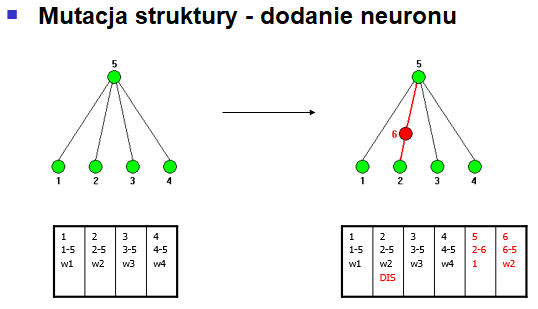
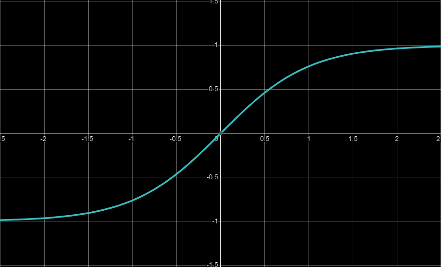
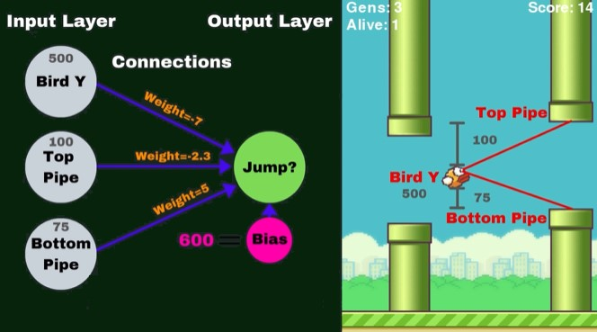
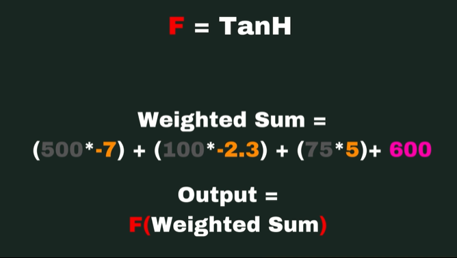
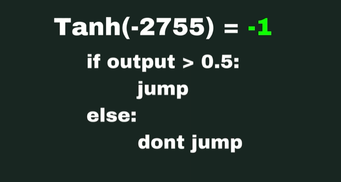

# NEAT algorytm
**NEAT (*Neuroevolution of Augmenting Topologies*)** - to jeden z algorytmów neuroewolucji, czyli ewolucji sztucznych sieci neuronowych. Ewoluuje on zarówno wagi połączeń, jak i strukturę sieci, próbując znaleźć równowagę między przydatnością opracowanych rozwiązań a ich różnorodnością.

Opiera się na zastosowaniu kluczowych technik :
 - śledzenie genów za pomocą znaczników historii, aby umożliwić krzyżowanie się topologii,
 - stosowaniu specjacji (ewolucji gatunków) w celu zachowania innowacji oraz stopniowym opracowywaniu topologii na podstawie prostych struktur początkowych

Tradycyjnie topologię sieci neuronowej wybiera człowiek, a efektywne wartości wag są poznawane w drodze procedury szkoleniowej. Prowadzi to do sytuacji, w której może być konieczna metoda prób i błędów w celu określenia odpowiedniej topologii. 

Podejście NEAT rozpoczyna się od sieci składającej się tylko z neuronów wejściowych i wyjściowych. W miarę postępu ewolucji poprzez dyskretne kroki, złożoność topologii może rosnąć albo poprzez wstawienie nowego neuronu do ścieżki połączenia, albo poprzez utworzenie nowego połączenia między (wcześniej niepołączonymi) neuronami.
***
### Ewolucja w NEAT
+ **Mutacje** - mogą one zmieniać wagi połączeń, dodawać nowe połączenia lub nowe neurony. Mutacje są jednym ze sposobów wprowadzania zmienności do populacji sieci neuronowych

- **Rekombinacje** - krzyżowanie genotypów dwóch rodzicielskich sieci neuronowych, co prowadzi do powstania potomnych sieci, które dziedziczą cechy obu rodziców.

- **Selekcja** - Sieci są oceniane na podstawie ich zdolności do rozwiązywania problemu (fitness). Najlepiej działające sieci są wybierane do tworzenia kolejnych pokoleń.

# Implementacja algorytmu

**Mechanika i zasady gry Flappy Bird**
Flappy Bird to prosta, ale wciągająca gra wideo, w której gracz steruje małym ptakiem poruszającym się po ekranie. Celem gry jest unikanie kolizji z przeszkodami w postaci pionowych rur, które mają otwory na różnych wysokościach. Gracz kontroluje ptaka poprzez klikanie lub stuknięcia, które sprawiają, że ptak podskakuje. Kiedy gracz nie klika, ptak opada na dół z powodu grawitacji. Gra kończy się natychmiast, gdy ptak zderzy się z rurą lub ziemią.

## Zastosowanie algorytmu NEAT w grze Flappy Bird

Algorytm NEAT można zastosować do nauki sterowania ptakiem w grze Flappy Bird bezpośrednio poprzez ewolucję sieci neuronowych. Oto szczegółowy opis tego procesu:

1. **_Reprezentacja problemów i przygotowanie_**
   1. Wejście sieci neuronowej:
	   - pozycja pionowa ptaka
	   - położenie górnej rury
	   - położenie dolnej rury
   2. Wyjście z sieci neuronowej:
	   - skok lub brak skoku
2. **_Inicjalizacja populacji_**
	- Algorytm zaczyna od generowania populacji sieci neuronowych z losowymi połączeniami i wagami. Każda sieć w populacji będzie sterować jednym ptakiem.
3. **_Ocena Fitness_**
	- Wartość Fitness jest określana na podstawie liczby rur, które ptak przeleci, zanim się rozbije. Im więcej rur ptak przeleci, tym wyższa wartość Fitness.
4. **_Ewolucja_**
	- Sieci neuronowe z wyższym Fitness mają większe szanse na bycie wybrane do krzyżowania i mutacji
5. **_Iteracja_**
	- Algorytm iteruje przez wiele pokoleń, za każdym razem oceniając Fitness sieci neuronowych, selekcjonując najlepsze, krzyżując je i mutując, aby stworzyć nową populację. 
6. **_Zakończenie_**
	- Po X etapach ewolucji, sieci neuronowe mogą ewoluować do punktu, w którym ptaki są w stanie skutecznie unikać rur przez dłuższy czas. 

## Dokładne omówienie gry

Omawiana gra posiada, jak wyżej było wspomniane, trzy neurony wejściowe:

- wysokość ptaka Y
- położenie górnej rury
- położenie dolnej rury

oraz jeden neuron wyjściowy: 

- skok albo brak skoku

**Połączenia** (*connections*) - inie pomiędzy neuronami wyjścia i wejścia, które przekazują dane.

**Wagi** (*weight*) - każde połączenie posiada swoją tzw. wagę, która określa jak mocne lub jak słabe jest połączenie jest między danymi neuronami.

**Bias** (*"przesunięcie"*) - dodatkowy parametr dodawany do sumy ważonej wejść przed zastosowaniem funkcji aktywacji. Dzięki niemu, neuron może lepiej dopasować sie do danych, niezależnie od wartości wejść.

**Suma ważona** (*weighted sum*) - to kluczowy krok w działaniu każdego neuronu w sieci. Polega ona na obliczeniu ważonej sumy wszystkich wejść, które następnie są przekazywane przez funkcję aktywacji, aby uzyskać wyjście neuronu.

**Funkcja aktywacji** (*activation funcion*) - wynik sumy ważonej jest przekształcany prze tę funkcję, aby uzyskać wyjście neuronu. W naszym przykładzie korzystamy z funkcji hiperbolicznego tangensa Tanh(x), który ze swojej właściwości nakłada przedział (-1, 1), co oznacza, że wynik może być zarówno dodatni, jak i ujemny.
$$tanh(x)$$

Zdjęcie poniżej obrazuje przykładowe wylosowane wartości dla neuronów wejściowych, wartości wag połączeń w sieci oraz biasu.

### Obliczenie sumy ważonej

Mając dane przekazane z neuronów wejściowych, wagi połączeń i biasu, algorytm oblicza tzw. sumę ważoną tych wartości według wzoru:
$$z = w_{1}x_{1}+w_{2}x_{2}+...+w_{n}x_{n}+b$$

Po wyliczeniu sumy ważonej, algorytm przekazuje ją przez funkcję aktywacji, aby uzyskać wyjście neuronu. Na tym etapie podejmowana jest decyzja:
-  $$Jeśli\;f(z) > 0.5,\;ptak \;skacze$$
-  $$Jeśli\;f(z) \leq 0.5,\;ptak \;nie\;skacze$$

